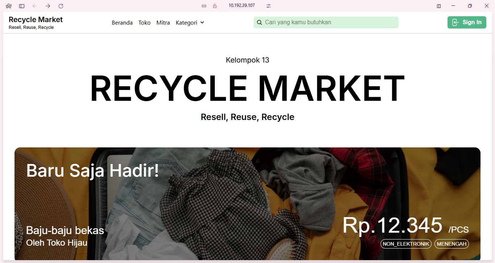
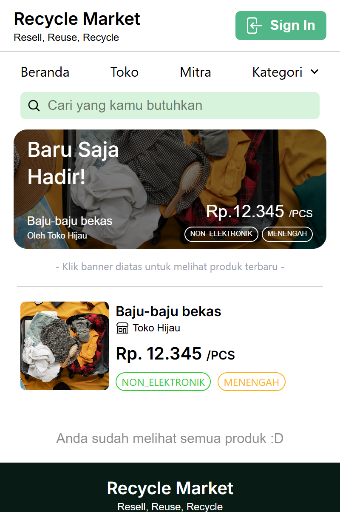
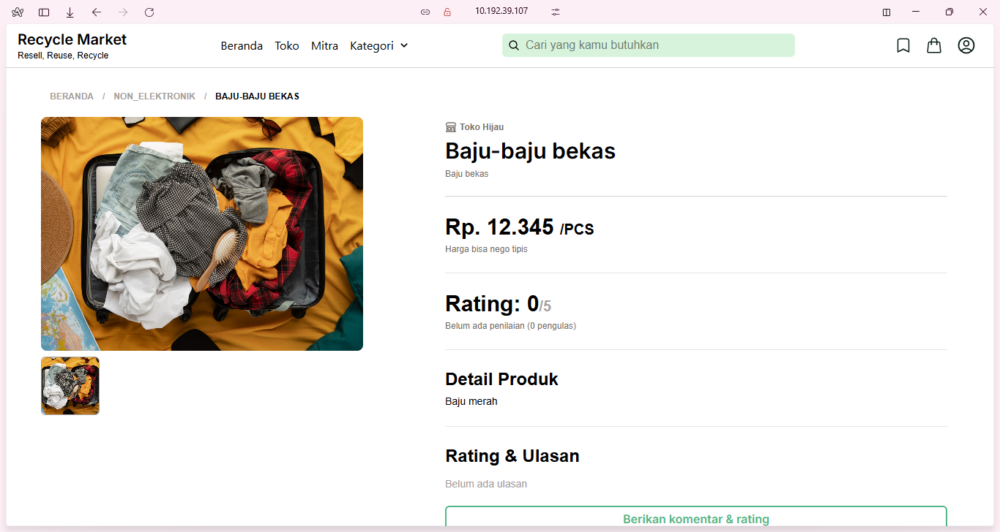
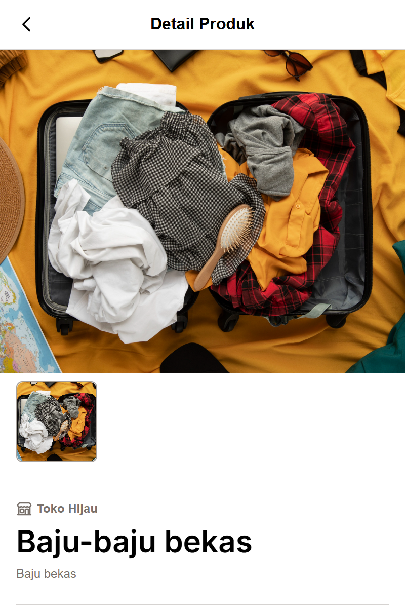
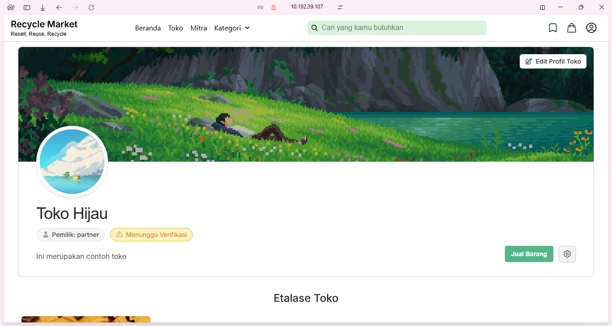
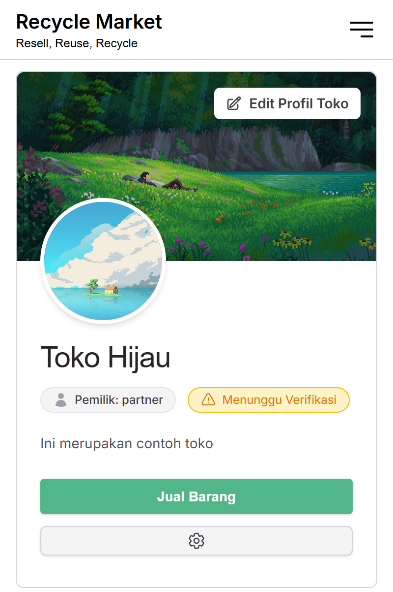
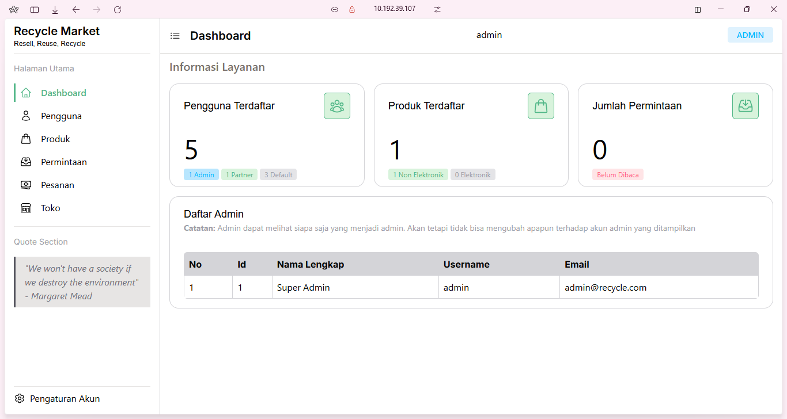
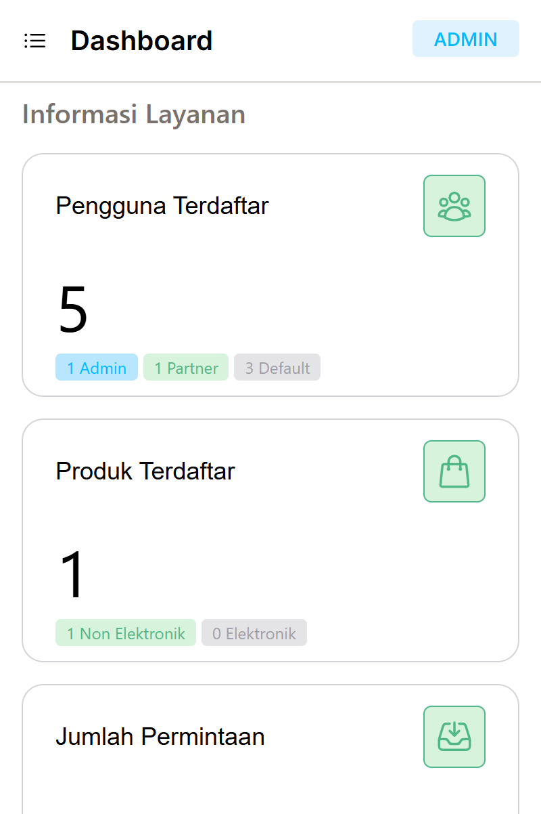

# [Recycle Market](https://github.com/Smurfish-py/recycle-market)

[](https://github.com/Smurfish-py/recycle-market)
[](https://github.com/Smurfish-py/recycle-market)
[](https://github.com/Smurfish-py/recycle-market)

Recycle-market, platform jual beli barang bekas yang masih memiliki nilai guna dan nilai jual. 

## Daftar Isi
Berikut adalah daftar isi dokumentasi project:
- [Daftar Isi](#daftar-isi)
- [Pengenalan](#pengenalan)
- [Tujuan](#tujuan)
- [Setup](#setup)
    - [Sebelum Memulai](#1-sebelum-memulai)
    - [Mempersiapkan Environment](#2-mempersiapkan-environment)
    - [Frontend](#3-frontend)
    - [Backend](#4-backend)
- [Media](#media-preview-singkat)

## Pengenalan
Recycle Market merupakan platform yang menyediakan layanan jual beli barang bekas yang masih layak digunakan, dimanfaatkan, atau diolah menjadi produk baru. Barang-barang bekas ini berasal dari sisa produk atau jajanan, seperti botol minum plastik, wadah styrofoam, stik bekas, sedotan bekas, dan lainnya. Tujuannya adalah mengurangi sampah daur ulang, memperpanjang masa pakai produk, serta menciptakan ekonomi sirkular di masyarakat.

## Tujuan
- Mempermudah penjualan dan pembelian barang bekas.
- Mempermudah akses pencarian barang bekas yang diperlukan untuk berbagai keperluan, baik untuk proyek sekolah maupun pembuatan barang lainnya.
- Mengurangi jumlah sampah yang sulit terurai dengan mengubahnya menjadi bahan atau produk yang bernilai jual dan bermanfaat.

## Tech Stack
- Backend : `ExpressJS`
- Frontend : `Vite` + `ReactJS` + `TailwindCSS`
- Database : `MySQL/PostgreSQL`
- Payment Gateway : `Midtrans`

## Setup
Berikut adalah dokumentasi setup project untuk development.

### 1. Sebelum Memulai
Hal-hal yang harus dipersiapkan sebelum memulai setup project:
- Pastikan `MySQL` sudah berjalan di perangkat anda.
- Salin kode server-key **midtrans**. Jika tidak memilikinya, silakan daftar akun midtrans **[disini](https://dashboard.midtrans.com/register)**.

### 2. Mempersiapkan Environment
Buat direktori baru dengan nama bebas (saya sarankan beri nama recycle-market).

```bash
# Buat direktori baru
mkdir recycle-market-env

# Masuk kedalam direktori
cd recycle-market-env
```

Clone repository project
```bash
# Clone repository Frontend
git clone https://github.com/smurfish-py/recycle-market

# Clone repository Backend
git clone https://github.com/smurfish-py/be-recycle-market
```

Sekarang environment kerja sudah siap, selanjutnya adalah mempersiapkan environment Frontend dan Backend.

### 3. Frontend
Masuk kedalam direktori `recycle-market` dan install dependensi 
```bash
# Masuk kedalam direktori
cd recycle-market

# Install dependensi
npm i
```

Copy file `.env.example` dan ubah namanya `.env`
```bash
cp .env.example .env
```

Konfigurasi variabel environment, contoh:
```bash
VITE_API_URL=http://localhost:3000 # Saya sarankan untuk testing, ganti localhost dengan IP lokal perangkat anda.
```
Jalankan project
```bash
npm run dev
```

Untuk build, jalankan perintah
```bash
# Build project
npm run build

# Preview hasil build
npm run preview
```
### 4. Backend
Masuk kedalam direktori `be-recycle-market` dan install dependensi 
```bash
# Masuk kedalam direktori
cd be-recycle-market

# Install dependensi
npm i
```

Copy file `.env.example` dan ubah namanya `.env`
```bash
cp .env.example .env
```

Konfigurasi variabel environment, contoh:
```bash
DATABASE_URL="mysql://root@localhost:3306/database-name" # Example: mysql://localhost:3306/my-database

PORT=1234 # Port where your backend will running. Example: if port set on 8667, you can access the backend by changing the VITE_API_URL in frontend to [server-address]:8667

JWT_SECRET="Secrets"

# Saya sarankan untuk testing, ganti localhost dengan IP lokal perangkat anda.

WEB_URL=http://localhost:5173 # Don't use any quotation marks ( "", '', `` ). Example :  http://yourfrontendurl.com 

SERVER_KEY="Mid-server-xxxxxxxxxxxxx" # This is for your Midtrans API Key

TOKEN_DURATION="1h" #Login Duration (example: 30m, 1h, 24h)
```

Jalankan project
```bash
npm run dev
```

### 4. Akses web
Akses situs dengan perintah :
```bash
http://localhost:5173

# atau

http://[ip-lokal-anda]:5173
```

## Media (Preview Singkat)
### Dashboard
**Desktop**

**Mobile**


### Halaman Detail Produk
**Desktop**

**Mobile**



### Halaman Toko
**Desktop**

**Mobile**


### Halaman Admin
**Desktop**

**Mobile**
